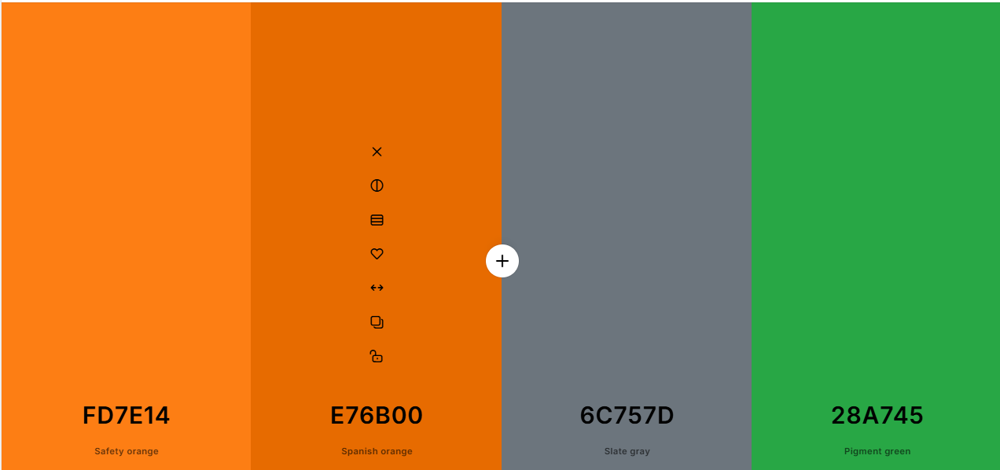
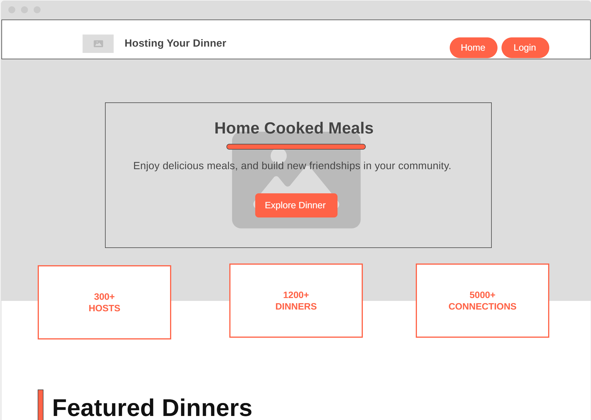
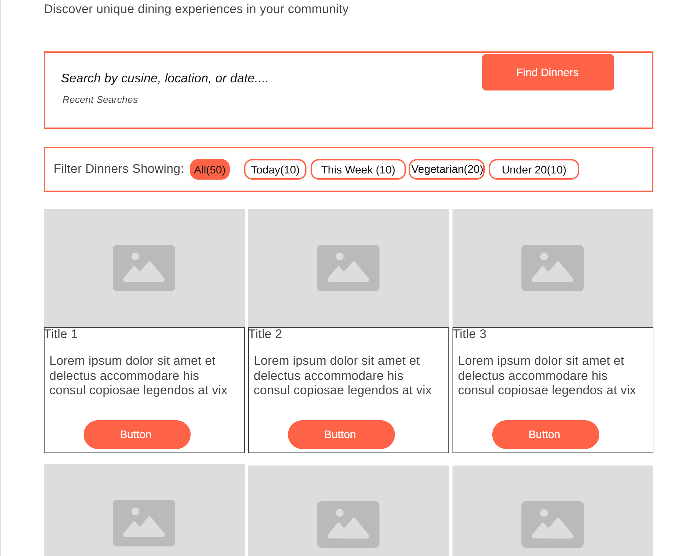
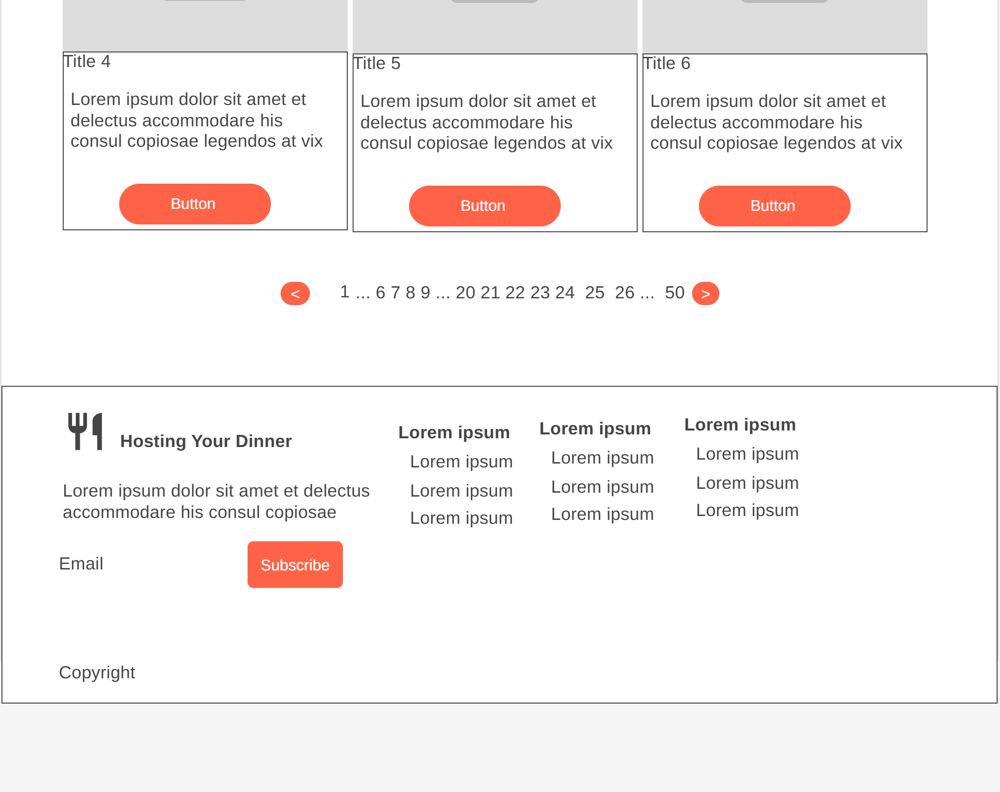
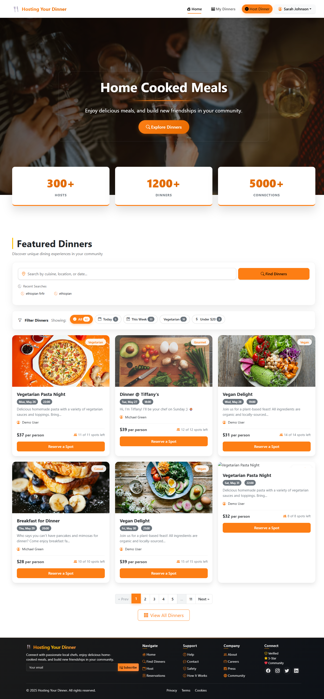
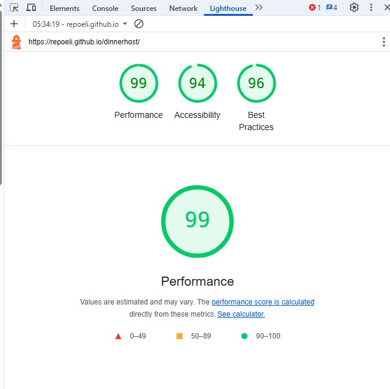

# 🍽️ Dinner Hosting Platform 🏠
Dinner Hosting Platform is an interactive **community driven web application** where passionate home cooks can host intimate dinner parties and food lovers can discover authentic culinary experiences. 

### **Live Demo**  
🔗 **Try the Platform Here:** [Home](https://repoeli.github.io/dinnerhost/) 


| 📱 **Mobile** | 📟 **Tablet** | 🖥️ **Desktop** |
|:-------------:|:-------------:|:---------------:|
|  |
| **375px+** | **768px+** | **1200px+** |
| Touch-optimized interface | Balanced layout | Full-featured experience |

**📸 Platform Overview**  


## 📖 Table of Contents  
- [📌 Project Overview](#-project-overview)  
- [🎨 UX/UI Design](#-uxui-design)  
  - [🛠️ User Stories](#-user-stories)  
  - [🎨 Colours](#-colours)  
  - [🔠 Fonts](#-fonts)  
  - [📐 Wireframes](#-wireframes)  
  - [🖼️ Imagery](#-imagery)  
- [🚀 Features](#-features)  
- [🛠️ Built With](#-built-with)  
- [🏗️ Technical Implementation](#-technical-implementation)  
- [✅ Testing](#-testing)  
- [🚀 Deployment](#-deployment)  
- [🔮 Future Features](#-future-features)  
- [🐞 Known Bugs](#-known-bugs)  
- [📜 Citation](#-citation)

---

## 📌 **Project Overview**  
**🎯 Key Objectives:**  
- Build a **multi-page interactive** web application using **HTML, CSS, and JavaScript**.  
- Connect food enthusiasts through a platform for hosting and discovering dinner events.  
- Focus on **user experience, accessibility, responsiveness, and DOM manipulation**.  
- Integrate external APIs for enhanced functionality (Unsplash for image search).  
- Implement **local storage** for data persistence and user management.  

---
 
## 🎨 **UX/UI Design**  

### 🛠️ **User Stories**  
**As a host, I want to...**  
✅ Create detailed dinner events with custom menus and pricing.  
✅ Manage my events through an intuitive dashboard.  
✅ View guest reservations and dietary preferences.  
✅ Search for beautiful food images to showcase my events.  
✅ Track my earnings and upcoming events.  

**As a guest, I want to...**  
✅ Browse and discover dinner events in my area.  
✅ Filter events by cuisine type, price, and date.  
✅ Make reservations with custom guest count and dietary preferences.  
✅ Manage my bookings through a personal dashboard.  
✅ Experience smooth navigation on **mobile, tablet, and desktop devices**.  

### 🎨 Colours

The colour palette for the **Dinner Hosting Platform** was carefully chosen to create a warm, inviting, and sophisticated dining experience.

| Colour  | Hex Code  | Usage |
|---------|----------|--------|
| 🟠 **Warm Orange** | `#FF8C42` | Primary buttons, accent elements |
| 🟡 **Golden Yellow** | `#FFD23F` | Warning elements, highlights |
| 🔴 **Deep Red** | `#C73E1D` | Error states, delete actions |
| 🟢 **Success Green** | `#28A745` | Success messages, confirmation |
| ⚪ **White** | `#FFFFFF` | Cards, modal backgrounds |
| ⚫ **Dark Grey** | `#343A40` | Main text, navigation |
| 🔵 **Info Blue** | `#17A2B8` | Information elements, links |

These colours create a **warm and welcoming** atmosphere while maintaining professional readability.

### Main palette  

**Primary Colour Palette** 
 

**Light Theme Colour Palette** 
 

**Dark Theme Colour Palette** 


### 🔠 **Fonts**  
The project uses **Bootstrap's default font stack** with **system fonts** for optimal performance and readability across all devices.  

### 📐 **Wireframes**  
Detailed wireframes were created for **mobile, tablet, and desktop layouts**.  
📌 **View Wireframes:**   

### 🖼️ **Imagery**  
The platform integrates with **Unsplash API** for high-quality food photography and uses **custom hero images** to create an appetizing visual experience.

#### 📱 **Responsive Design Showcase**
The platform is fully responsive and optimized for all device types:

| 📱 **Mobile** | 📟 **Tablet** | 🖥️ **Desktop** |
|:-------------:|:-------------:|:---------------:|
|  |  |  |

---

## 🚀 **Features**  
### 🏠 Core Platform Features  
✅ **Event Creation & Management** – Hosts can create detailed dinner events with pricing and guest limits.  
✅ **Advanced Search & Filtering** – Filter by cuisine, price range, date, and dietary preferences.  
✅ **Reservation System** – Simple booking process with guest count and special requirements.  
✅ **Dual Dashboard System** – Separate interfaces for hosts and guests.  
✅ **Image Integration** – Unsplash API integration for beautiful food photography.  
✅ **Real-time Updates** – Live tracking of available spots and booking status.  

### 🎨 UI & User Experience  
✅ **Responsive Design** – Optimized for **mobile, tablet, and desktop**.  
✅ **Interactive Modals** – Smooth modal animations for forms and confirmations.  
✅ **Dynamic Notifications** – Instant feedback for all user actions.  
✅ **Accessible Design** – ARIA attributes and keyboard navigation support.  

---

## 🛠️ **Built With**  
### 🖥️ **Technology & Languages**  
  
  
  

### 📚 **Libraries & Frameworks**  
- **Bootstrap 5.3** – Responsive UI framework and component library  
- **Bootstrap Icons 1.10** – Comprehensive icon library  
- **Unsplash API** – High-quality food photography via secure proxy  
- **Local Storage API** – Browser-based data persistence  

### 🏗️ **Architecture & Structure**  
- **Modular JavaScript** – Organized utility modules for reusability  
- **Responsive CSS Grid & Flexbox** – Modern layout techniques  
- **API Proxy Architecture** – Secure backend proxy for external API calls  
- **Local Data Management** – JSON-based storage system

### 🛠️ **Tools Used**  
- **GitHub** – Version control, collaboration, and GitHub Pages deployment  
- **VS Code** – Primary development environment with extensions  
- **Chrome DevTools** – Debugging, performance testing, and responsive design  
- **Heroku** – Secure proxy backend hosting  
- **Local Storage** – Client-side data persistence without backend database  
- **W3C Validators** – HTML and CSS validation tools  
- **Lighthouse** – Performance, accessibility, and SEO auditing

---

## ✅ **Testing**  

### 🧪 **Validation & Code Quality**
- ✅ **HTML Validation** – Checked with **W3C Validator** for semantic markup.  
- ✅ **CSS Validation** – Tested with **Jigsaw Validator** for standards compliance.  
- ✅ **JavaScript Validation** – ESLint standards and error-free console debugging.  
- ✅ **Accessibility Testing** – ARIA attributes and keyboard navigation support.  

### ⚡ **Performance & SEO**
- ✅ **Lighthouse Testing** – Scored high in Performance, Accessibility, Best Practices, and SEO.  
- ✅ **Mobile-First Design** – Optimized for fast loading on mobile devices.  
- ✅ **Image Optimization** – Responsive images with proper alt text.  

### 📱 **Responsiveness & Compatibility**
- ✅ **Cross-Device Testing** – Verified on mobile (375px), tablet (768px), and desktop (1200px+).  
- ✅ **Cross-Browser Testing** – Compatible with Chrome, Firefox, Safari, and Edge.  
- ✅ **Touch Interface** – Optimized for touch interactions on mobile devices.  



### 🔧 **Functional Testing**
- ✅ **API Integration** – Unsplash image search working via secure proxy.  
- ✅ **Data Persistence** – Local storage for reservations and user data.  
- ✅ **Error Handling** – Graceful fallbacks for network failures.  
- ✅ **Form Validation** – Client-side validation for all user inputs.  

### 📊 **Testing Checklist**
**Homepage Features:**
- [ ] Hero section animations and call-to-action buttons
- [ ] Dinner event filtering by cuisine, price, and date
- [ ] Event reservation modal with guest count selection
- [ ] Image search functionality for event creation

**Dashboard Features:**
- [ ] Host dashboard: Create, edit, and manage dinner events
- [ ] Guest dashboard: View and manage reservations
- [ ] Data persistence across browser sessions
- [ ] Responsive modal interactions

**Security & Performance:**
- [ ] No API keys exposed in frontend code
- [ ] Secure proxy handling all external API calls
- [ ] Fast loading times (<3 seconds on 3G)
- [ ] No console errors in production build

## 🚀 **Deployment**  
### **Deployed via GitHub Pages**   

📌 **Live Demo:** [Add your live demo link here]  

### **Setup Instructions**  
1. **Clone the repository**
   ```bash
   git clone [your-repository-url]
   cd dinner-hosting-platform
   ```

2. **Configure API Integration**
   - ✅ **Secure Proxy Implementation**: The application uses a secure Heroku proxy for Unsplash API access
   - ✅ **No API Key Required**: The proxy handles authentication automatically
   - ✅ **Endpoint**: `https://unsplash-proxy-app-fb6c8f079fb7.herokuapp.com/search`
   - ✅ **CORS Enabled**: Properly configured for cross-origin requests

3. **Run the Application**
   - **Option 1**: Open `index.html` directly in your web browser
   - **Option 2**: Use a local development server:
     ```bash
     # Python 3
     python -m http.server 8080
     
     # Node.js (if you have live-server installed)
     npx live-server
     ```

4. **Testing the Setup**
   - Navigate to the homepage
   - Click "Create Dinner Event" 
   - Test the image search functionality
   - Verify images load correctly from the secure proxy

### **Security Features**
🔒 **API Key Protection**: No sensitive keys exposed in frontend code  
🛡️ **Secure Proxy**: All API requests routed through Heroku backend  
⚡ **Timeout Handling**: 10-second request timeout with graceful fallback  
🎨 **Fallback Images**: Demo images available during development

---

## 🔮 **Future Features**  
🚀 **Payment Integration** (Stripe/PayPal for secure transactions).  
🚀 **Real-time Chat** (Communication between hosts and guests).  
🚀 **Location-based Search** (GPS integration for nearby events).  
🚀 **Rating & Review System** (User feedback and ratings).  
🚀 **Email Notifications** (Booking confirmations and reminders).  
🚀 **Mobile App** (Native iOS and Android applications).  
🚀 **Multi-language Support** (Internationalization).  

---

## 🌓 **Light and Dark Mode**  
The platform now features a professionally implemented light/dark mode toggle that enhances user experience:

✅ **Persistent Preference** - User theme choice is saved between sessions  
✅ **System Preference Detection** - Automatically matches system preferences on first visit  
✅ **Accessibility Focused** - Maintains proper contrast ratios in both themes  
✅ **Seamless Transitions** - Smooth animations when switching between modes  
✅ **Consistent Design Language** - Maintains visual hierarchy and brand identity in both modes  

Users can toggle between light and dark modes using the sun/moon toggle switch in the navigation bar.

---

## 🐞 **Known Bugs & Limitations**  

### ⚠️ **Current Limitations**
❌ **Local Storage Capacity** – Limited to ~5-10MB per domain (suitable for demo purposes).  
❌ **API Rate Limits** – Unsplash proxy may have rate limiting during high traffic.  
❌ **Browser Compatibility** – Some modal animations may be inconsistent on Internet Explorer.  
❌ **Offline Functionality** – Requires internet connection for image search features.  

### 🔧 **Planned Fixes**
🛠️ **Database Integration** – Transition from local storage to proper backend database.  
🛠️ **Caching System** – Implement image caching for better performance.  
🛠️ **Progressive Web App** – Add offline support and app-like features.  
🛠️ **Enhanced Error Recovery** – More robust error handling and user feedback.

---

## 📜 **Citations**

The following resources were used in the development of **Dinner Hosting Platform**:

### 🎨 Fonts & UI
- **Bootstrap 5**: [Bootstrap Framework](https://getbootstrap.com/)
- **Bootstrap Icons**: [Bootstrap Icons Library](https://icons.getbootstrap.com/)

### 🖼️ Images & API
- **Unsplash API**: [Unsplash Developers](https://unsplash.com/developers) for high-quality food photography
- **Hero Background**: Custom food photography for landing page

### 🛠️ Development Tools
- **HTML & CSS Validation**: [W3C Validator](https://validator.w3.org/) & [Jigsaw CSS Validator](https://jigsaw.w3.org/css-validator/)
- **JavaScript Documentation**: [MDN Web Docs](https://developer.mozilla.org/)
- **GitHub Hosting**: [GitHub Pages](https://pages.github.com/)

### 🧩 Design Tools
- **Wireframe**: [Figma](https://wireframe.cc/) for wireframing and UI design
- **Canva**: [Canva](https://www.canva.com//) for image editing and design

### 🤖 AI Assistance
- **GitHub Copilot**: [GitHub Copilot](https://github.com/features/copilot) for AI-powered coding assistance

---

## 🏗️ **Technical Implementation**

### 🔧 **Application Architecture**
```
Frontend (Static Files)
├── HTML Pages (Multi-page SPA)
│   ├── index.html (Homepage)
│   ├── host-dashboard.html (Host Management)
│   ├── guest-dashboard.html (Guest Management)
│   └── registration.html (User Registration)
├── CSS Assets
│   ├── styles.css (Main styling)
│   └── navbar.css (Navigation components)
└── JavaScript Modules
    ├── script.js (Homepage functionality)
    ├── host-dashboard.js (Host management)
    ├── guest-dashboard.js (Guest management)
    ├── registration.js (User registration)
    ├── modal-utils.js (Modal management utilities)
    ├── enhanced-data-utils.js (Data persistence)
    ├── api-config.js (API configuration)
    └── handleHeroSearch.js (Search functionality)

Backend Proxy (Heroku)
└── app.py (Flask proxy for Unsplash API)
```

### 🔒 **Security Implementation**
**API Key Protection**
- ✅ Unsplash API key stored as environment variable on Heroku
- ✅ Frontend makes requests to proxy, not directly to Unsplash
- ✅ CORS properly configured for cross-origin requests
- ✅ Request timeout handling (10 seconds) with graceful fallbacks

**Data Security**
- ✅ Client-side data validation for all forms
- ✅ XSS prevention through proper DOM manipulation
- ✅ No sensitive data stored in local storage

### 📊 **Data Management**
**Local Storage Structure**
```json
{
  "dinners": [
    {
      "id": "unique-id",
      "title": "Dinner Title",
      "cuisine": "Italian",
      "price": 45,
      "date": "2025-06-15",
      "maxGuests": 8,
      "currentGuests": 3,
      "description": "Dinner description",
      "image": "image-url",
      "photographer": "Photographer Name",
      "hostName": "Host Name"
    }
  ],
  "reservations": [
    {
      "id": "reservation-id",
      "dinnerId": "dinner-id",
      "guestName": "Guest Name",
      "guestCount": 2,
      "specialRequests": "Dietary preferences",
      "reservationDate": "2025-05-24"
    }
  ],
  "currentUser": {
    "name": "User Name",
    "email": "user@example.com",
    "userType": "host|guest"
  }
}
```

### 🎨 **UI/UX Features**
- **Responsive Grid System** – Bootstrap 5.3 grid with custom breakpoints
- **Interactive Modals** – Smooth animations with backdrop blur effects
- **Dynamic Content Loading** – Real-time updates without page refreshes
- **Accessibility Features** – ARIA labels, keyboard navigation, focus management
- **Loading States** – Spinner animations during API calls
- **Error Boundaries** – Graceful error handling with user-friendly messages

### ⚡ **Performance Optimizations**
- **Lazy Loading** – Images loaded on demand
- **Minified Assets** – Compressed CSS and JavaScript files
- **Efficient DOM Manipulation** – Minimal reflows and repaints
- **Local Caching** – Browser storage for frequently accessed data
- **Optimized Images** – Responsive images with appropriate sizing

---

🍽️ **Thank you for using Dinner Hosting Platform!** 🏠 We hope you create amazing culinary connections! 🚀
